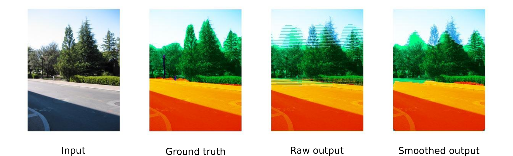
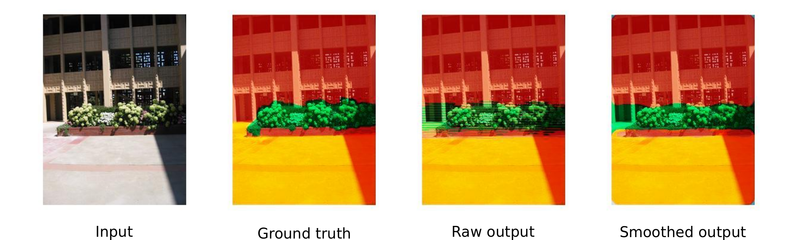

# Documentation and Tutorial
libcnn is a modular deep learning libraray, useful for robotics and computer vision.
It is being developed by [Robotics and Multi-perception Lab](http://ram-lab.com) of City Univerisity of
Hong Kong.

# Quick Start
Here is a quick version to help you get started with the library.

The library has a light dependancy list:  

* [Eigen](http://eigen.tuxfamily.org) vesion 3, a C++ template library for linear algebra:
matrices, vectors, numerical solvers, and related algorithms.  
* [boost](http://www.boost.org/) version 1.49, peer-reviewed portable C++ source libraries.

The library was compiled on Ubuntu

## Compilation and Installation

`mkdir build`  
`cd build`  
`cmake ..`  
`make`  
`sudo make install (optional)`

## Example:
We show an example of pixel-wise classification: scene-labelling.  
The example used [semantically-augmented make3d dataset](http://dags.stanford.edu/data/cvpr10Data.tar.gz). The following
assumes that you have already successfully done the above.  

`cd build`   
`./train`    (training)  
`./validate` (testing)

## Sample Results
Here are several pixel-wise classification results of [semantically-augmented make3d dataset](http://dags.stanford.edu/data/cvpr10Data.tar.gz)  

# Bug Reporting
Please use [github's issue tracker](https://github.com/libcnn/libcnn/issues) to report bugs
